# Add HDB Resale Data into Supabase

## Account Creation
- Create a free account if you have not already done so.
- First, enter a project name
- Next, enter a database password, please copy the password and place it some where safe. Click `Create new project` when done.

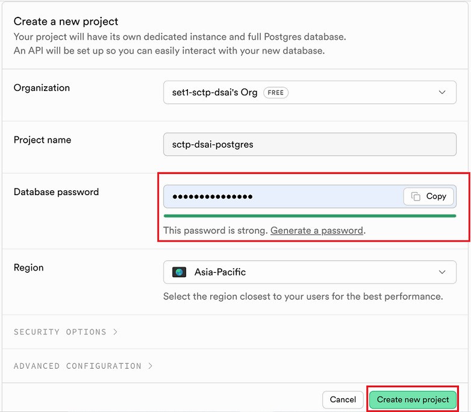

## Preparing Data File
- The data file named is located at the data [folder](data/) 
- File name is `ResaleflatpricesbasedonregistrationdatefromJan2017onwards.csv`

## Importing CSV to Supabase
- Create a table under table editor but do not enter anything yet.

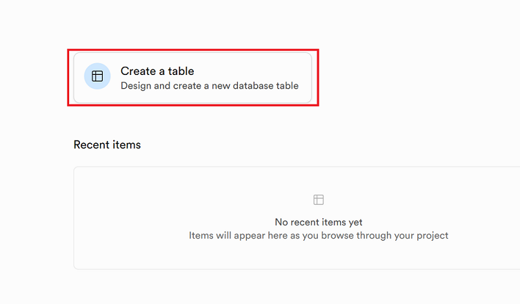

- Enter the table name as shown: `resale_flat_prices_from_jan_2017`

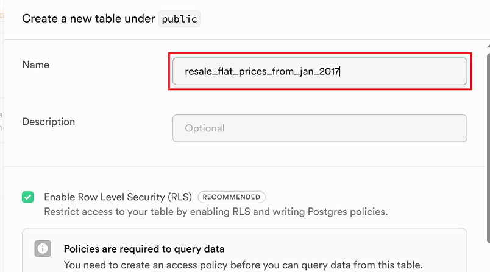

- Click `Import Data from CSV`

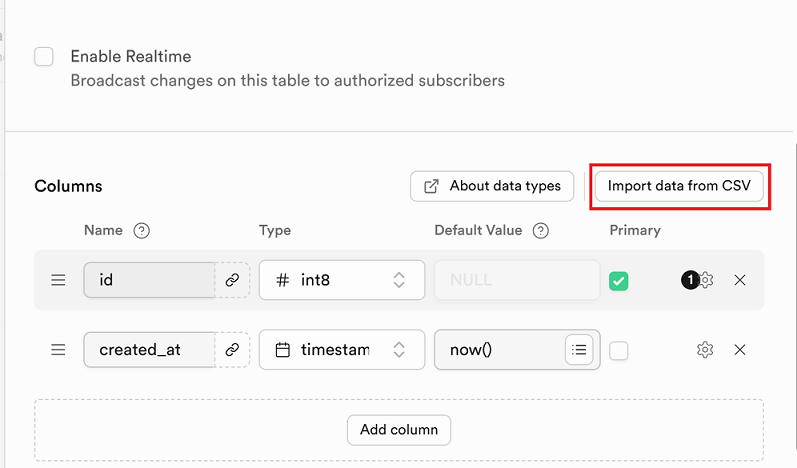

- Click `browse` (some classmate got issue with drag and drop)

- Once your file is loaded, you should see something like below, click `Save` to import:

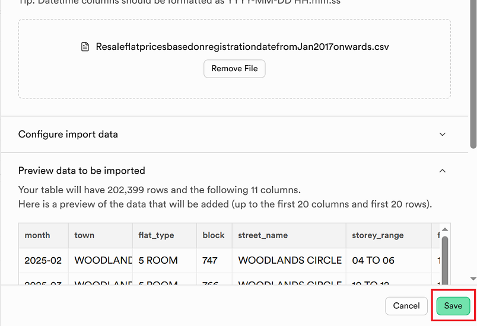

- Click `Save` again

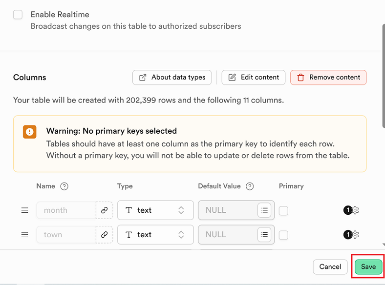

- You should see the import progress as shown below, this will take a while:

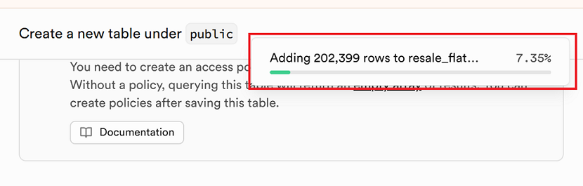

### Create primary key
- Once it is done, we need to add primary key, click insert and select columns

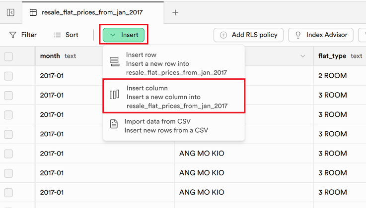

- Set the id, type and identity

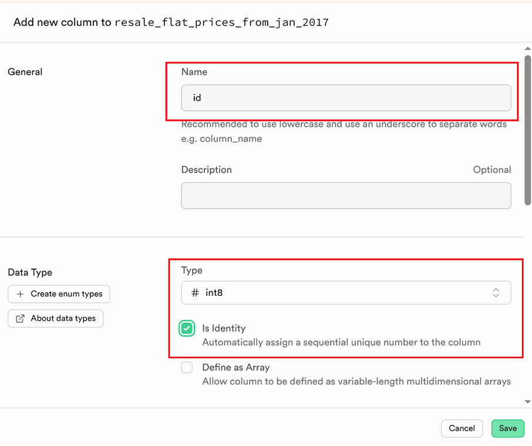

- Follow the checks below and click save:

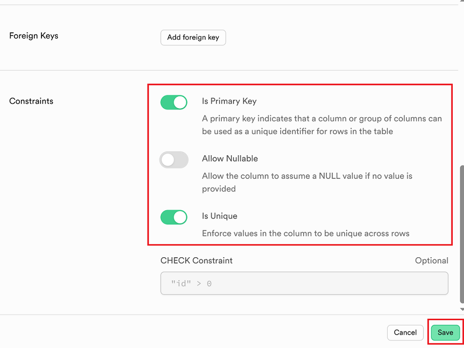

- We should have the result below:

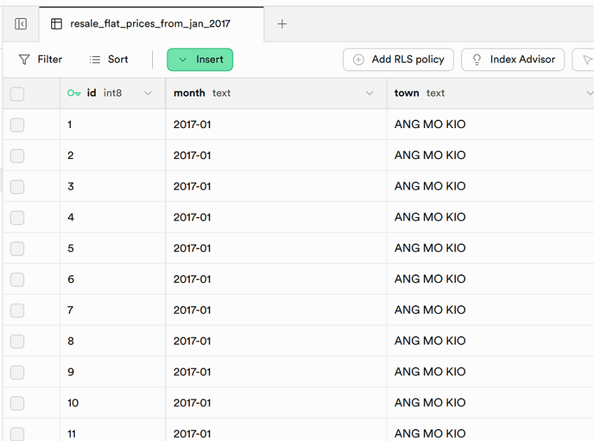

## Connection with Supabase
To get the connection setting from Supabase, please follow the steps below:

- Click connect
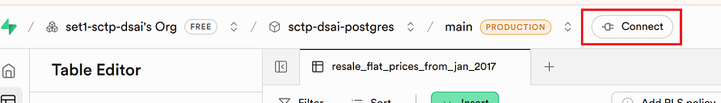

- Change connection method from `Direct connection` and to `Session pooler`
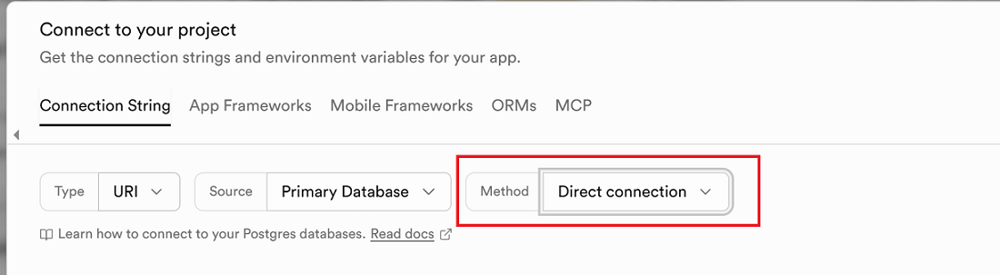
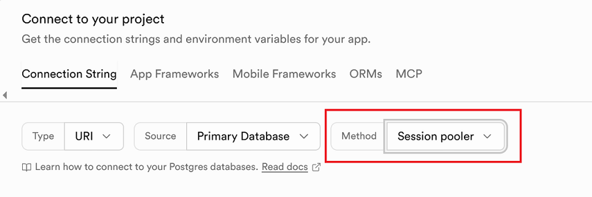

### Connection Type
- For connection type, we use the default `URI` , the setting should be similar across different type. 
- If you want to test your connection in Python, you can select `Python` or `SQLAlchemy`
- If you select Python or SQL Alchemy, additional Python code will be provided for us to test the connection. 

### Connection Method 
- This is related to your specific ISP. In Singapore, we stick to `Session pooler`. This is for ISP who uses IPv4.
- If you encounter error with `Session pooler`, and you know that your ISP uses only IPv6, then you can try `Direct connection`.

### Get Connection Parameters - Session pooler
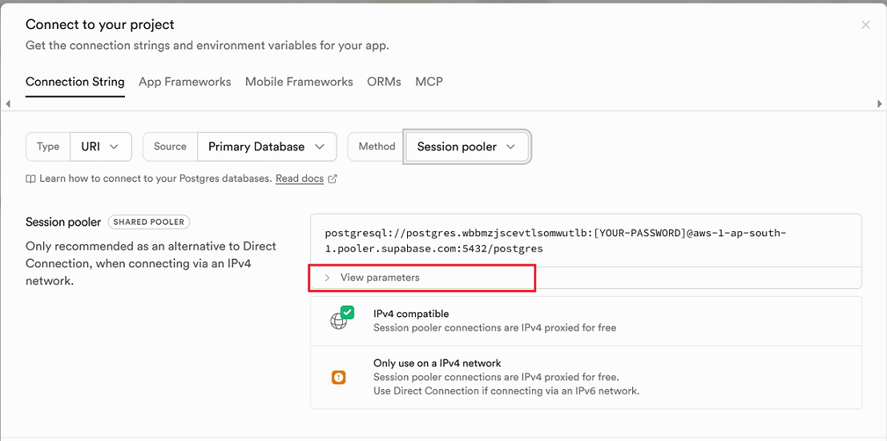
- Click `View parameters`
- The settings that is related to your database will be presented to you.

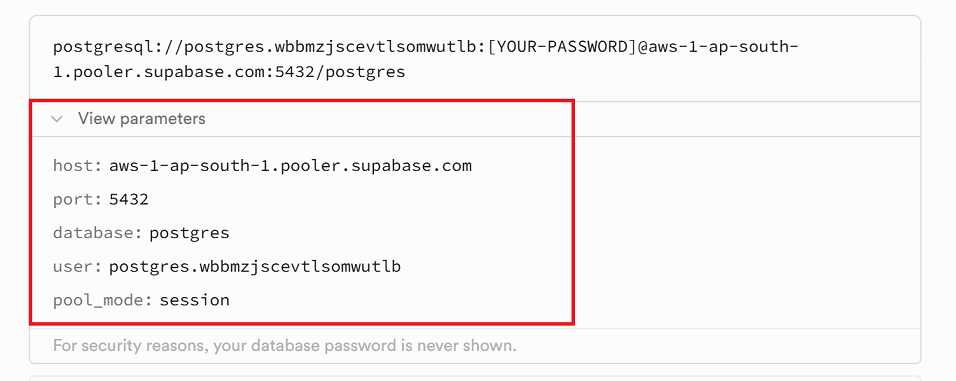
- **Take note of the parameters as we need it to configure Meltano. Please note that we also need to have the db password we created on the first step.**

### Testing Connection
If you encounter connection issues with Meltano, you can try choosing Python or SQLAlchemy. Next to the connection string, the code to test the connection is provided.

### Possible Connection Error
Supabase, uses IPV6 for direct connection, so the problem may depend on your ISP. Anyway, the following warning is shown:

- Try `Session pooler` first and if error try `Direct connection`.

Reference link: https://supabase.com/docs/guides/database/connecting-to-postgres
